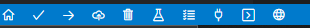

# Prusa Firmware MK3

This repository contains the source code and the development versions of the firmware running on the [Original Prusa i3](https://prusa3d.com/) MK3S/MK3/MK2.5S/MK2.5 line of printers.

The latest official builds can be downloaded from [Prusa Drivers](https://www.prusa3d.com/drivers/). Pre-built development releases are also [available here](https://github.com/prusa3d/Prusa-Firmware/releases).

The firmware for the Original Prusa i3 printers is proudly based on [Marlin 1.0.x](https://github.com/MarlinFirmware/Marlin/) by Scott Lahteine (@thinkyhead) et al. and is distributed under the terms of the [GNU GPL 3 license](LICENSE).

# Table of contents

<!--ts-->
   * [Cross-Platform build](#cross-platform)
   * [Automated tests](#automated-tests)
   * [Documentation](#documentation)
   * [FAQ](#5-faq)
<!--te-->

# Build
## Cross-Platform
### Using PlatformIO

#### 1. Development environment preparation

**a.** Install `"Visual Studio Code"` from the official website `https://code.visualstudio.com/` 

**b.** Install `"PlatformIO IDE"` from the Extension Marketplace

#### 2. Source code compilation

* Clone this repository and checkout the correct branch for your desired release version.

*  In the subdirectory `"Firmware/variants/"` select the configuration file (`.h`) corresponding to your printer model, make copy named `"Configuration_prusa.h"` (or make simple renaming) and copy it into `"Firmware/"` directory. 

* Open the folder in Visual Studio Code

* In the bottom-right corner there will be several icons
  * 

* Click the `Right-arrow Icon` or `PlatformIO: Upload`. It will compile and upload the code.

* or you can also save the output code to the file (in so called `HEX`-format) `"firmware.hex"`:  Click on the `Tick Icon` or `PlatformIO: Build` and then upload it to the printer using the program `"FirmwareUpdater"`  
_note: this file is created in the directory `"build/prusa_rambo/"`_  

# Automated tests
## PlatformIO Tests still need to be design

# Documentation
## TBD

# FAQ
# THIS QUESTIONS ARE FROM PRUSA (NOT ME)
Q:I built firmware using Arduino and I see "?" instead of numbers in printer user interface.

A:Step 1.c was ommited or you updated Arduino and now platform.txt located somewhere in your user profile is used.

Q:I built firmware using Arduino and printer now speaks Klingon (nonsense characters and symbols are displayed @^#$&*°;~ÿ)

A:Step 2.c was omitted.

Q:What environment does Prusa use to build the firmware in the first place?

A:Our production builds are 99.9% equivalent to https://github.com/prusa3d/Prusa-Firmware#linux this is also easiest way to build as only one step is needed - run single script, which downloads patched Arduino from github, builds using it, then extracts translated strings and creates language variants (for MK2x) or language hex file for external SPI flash (MK3x). But you need Linux or Linux in virtual machine. This is also what happens when you open pull request to our repository - all variants are built by Travis http://travis-ci.org/ (to check for compilation errors). You can see, what is happening in .travis.yml. It would be also possible to get hex built by travis, only deploy step is missing in .travis.yml. You can get inspiration how to deploy hex by travis and how to setup travis in https://github.com/prusa3d/MM-control-01/ repository. Final hex is located in ./lang/firmware.hex Community reproduced this for Windows in https://github.com/prusa3d/Prusa-Firmware#using-linux-subsystem-under-windows-10-64-bit or https://github.com/prusa3d/Prusa-Firmware#using-git-bash-under-windows-10-64-bit .

Q:Why are build instructions for Arduino mess.

Y:We are too lazy to ship proper board definition for Arduino. We plan to swich to cmake + ninja to be inherently multiplatform, easily integrate build tools, suport more IDEs, get 10 times shorter build times and be able to update compiler whenewer we want.
